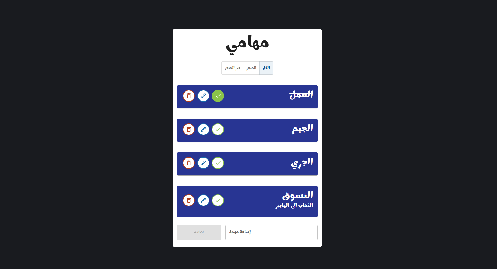
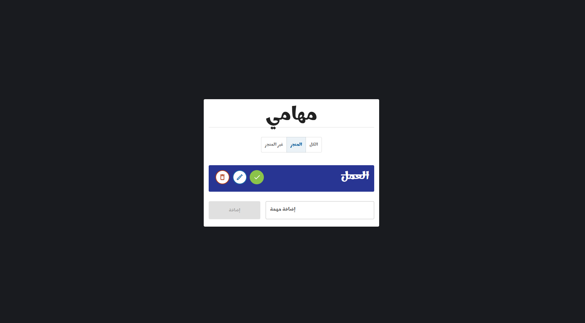
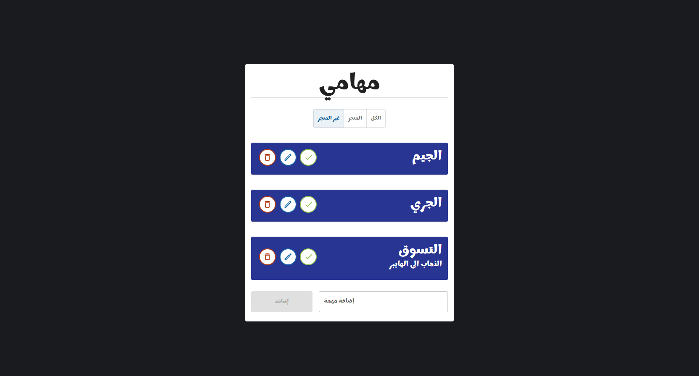
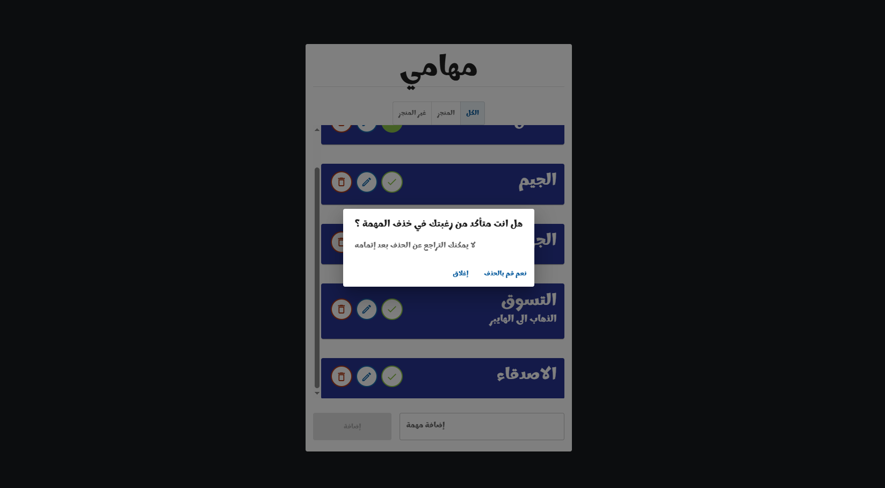

# ✅ Todo List App

A simple and effective task management application that helps users organize their daily tasks with a clean interface and essential features.

---

## Features

- Add, edit, and delete tasks بسهولة  
- Mark tasks as completed or pending  
- Filter tasks by status (All / Completed / Pending)  
- Clean and intuitive user interface  
- Fully responsive design (works on all devices)  
- Data persistence using Local Storage  

---

## Tech Stack

- React.js  
- Material UI  
- React Router DOM  
- UUID  
- Local Storage  
- HTML5  
- CSS3  

---

## Installation

1. Clone the repository:  
   git clone https://github.com/ahmedibra24/Todo-List.git  

2. Navigate to project folder:  
   cd todo-list  

3. Install dependencies:  
   npm install  

4. Run the development server:  
   npm start  

5. Open in browser:  
   http://localhost:3000  

---

## Usage

- Add new tasks  
- Edit or delete tasks  
- Mark tasks as completed  
- Filter tasks based on their status  

---

## Screenshots

  
  
  
  

---

## Challenges Solved

- Designing a simple and user-friendly task management UI  
- Managing application state efficiently using React  
- Persisting data using Local Storage  
- Ensuring smooth performance and responsiveness  

---

## Future Improvements

- Drag & drop tasks  
- Due dates & reminders  
- Dark mode  
- User authentication  
- Sync with backend (API)  

---